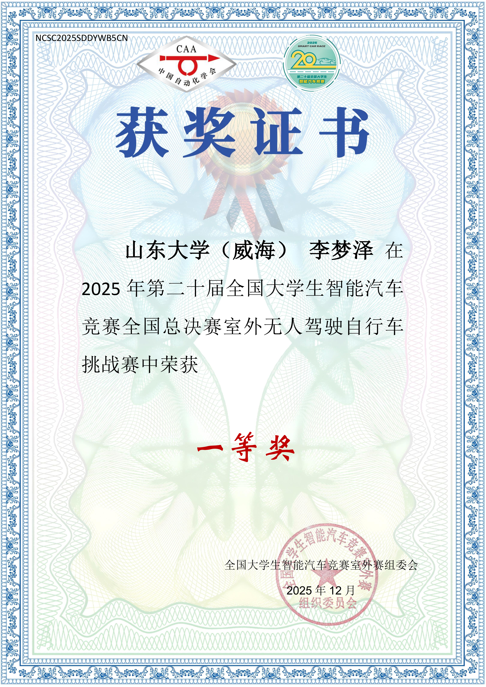
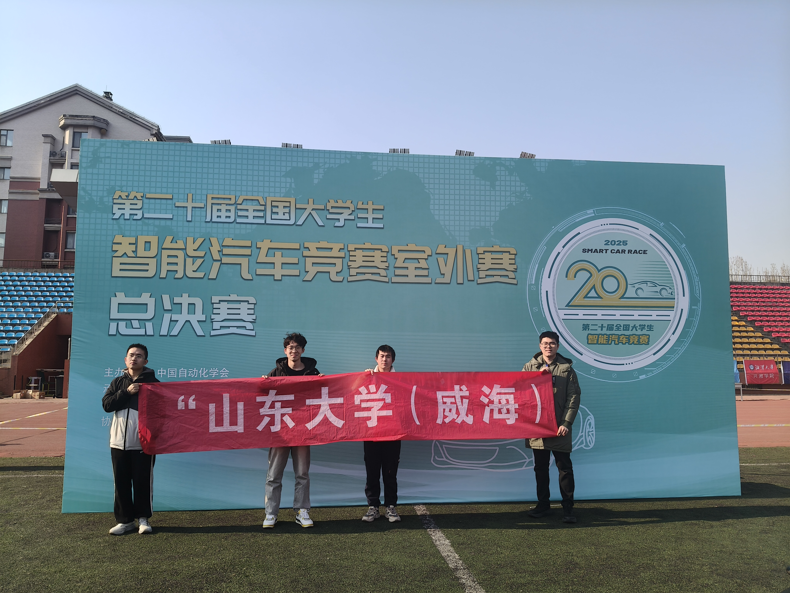
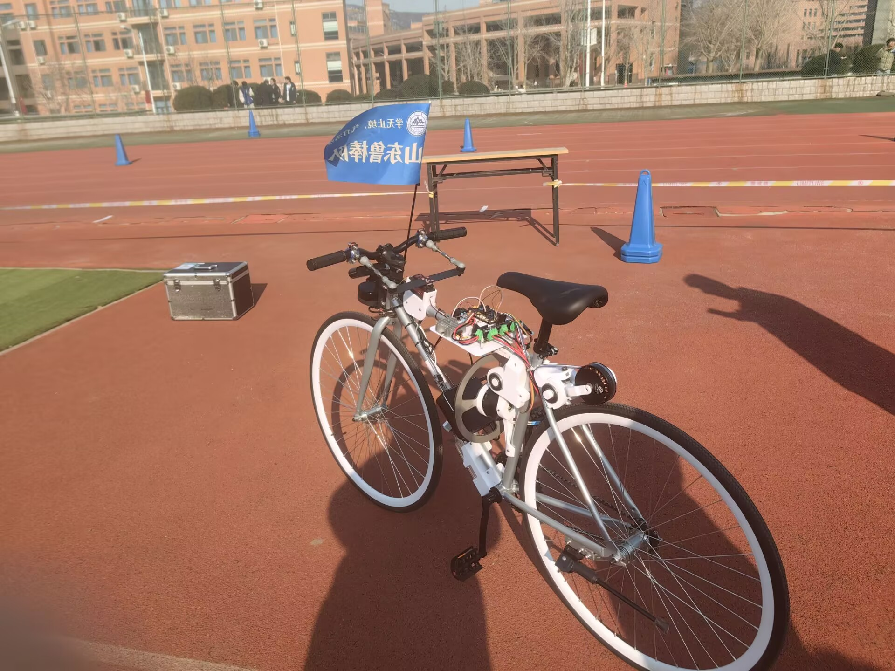

# 基于 STM32、ODrive 与 OpenCV 的室外无人驾驶平衡自行车系统

## 项目简介

本仓库用于整理和展示本人在 **2025 年第二十届全国大学生智能汽车竞赛全国总决赛室外无人驾驶自行车挑战赛** 中参与完成的室外无人驾驶平衡自行车工程。

项目以真实自行车平台为载体，围绕 **飞轮动态平衡、视觉循迹、左右避障、人行道停车等待、终点永久停车、摄像头与单片机可靠通信** 等任务展开。系统采用 **摄像头 OpenCV 视觉识别 + STM32 状态机控制 + ODrive 电机驱动 + IMU 姿态反馈** 的总体架构，实现室外赛道下无人驾驶自行车的稳定运行。

本工程主要包含摄像头视觉识别、STM32 车辆状态机、ODrive 电机控制和 IMU 平衡控制等模块：

- 摄像头端负责赛道线检测、蓝色锥桶障碍物检测、斑马线检测、终点检测以及串口通信；
- 单片机端负责平衡控制、后轮速度控制、舵机循迹、避障距离累计、人行道 30 秒停车、终点停车和状态机调度；
- 双方通过带序号和 ACK 的串口协议通信，避免关键事件丢包和重复触发。

---

## 项目成果

本项目参加 **2025 年第二十届全国大学生智能汽车竞赛全国总决赛室外无人驾驶自行车挑战赛**，获得：

> **全国总决赛一等奖**



---

## 项目展示

### 参赛合影



### 室外无人驾驶自行车实车平台



---

## 项目背景

室外无人驾驶自行车挑战赛不同于普通四轮智能车。四轮车主要关注路径识别、转向控制和速度控制，而自行车还必须解决 **低速平衡和停车保持姿态** 的问题。

自行车本身是欠驱动系统，低速和静止时容易失稳。因此，本项目的核心难点不是简单地“识别赛道然后转向”，而是要在以下场景下都维持车体稳定：

- 正常循迹行驶；
- 遇到蓝色锥桶后进行左右避障；
- 遇到人行道/斑马线后停车 30 秒；
- 到达终点后永久停车；
- 停车和低速状态下仍然保持飞轮平衡。

因此，本项目采用 **平衡控制始终运行，任务状态只改变后轮速度、目标线和停车逻辑** 的设计思想。

---

## 系统总体架构

```text
摄像头 OpenCV 视觉识别
        ↓
跑道线 / 蓝色锥桶 / 斑马线 / 终点
        ↓
UART7 串口协议通信
        ↓
STM32 车辆状态机
        ↓
正常循迹 / 避障 / 人行道停车 / 终点停车
        ↓
舵机转向 + 后轮速度控制
        ↓
ODrive 控制飞轮电机与后轮电机
        ↓
IMU 姿态反馈
        ↓
飞轮平衡控制
```

系统分为三层：

1. **视觉感知层**  
   摄像头基于 OpenCV 完成跑道线检测、障碍物检测、斑马线检测和终点检测。

2. **任务决策层**  
   STM32 根据摄像头事件切换车辆状态，包括正常、避障、人行道、终点四种状态。

3. **底层控制层**  
   IMU 提供姿态反馈，飞轮电机负责横向平衡，后轮电机负责前进与停车，舵机负责路径修正。

---

## 硬件组成

| 模块 | 作用 |
|---|---|
| STM32F4 主控 | 车辆状态机、串口通信、平衡控制和任务调度 |
| 摄像头模块 | 视觉循迹、障碍物识别、斑马线识别、终点识别 |
| IMU 姿态传感器 | 提供车体横滚角和角速度 |
| ODrive 控制器 | 控制飞轮电机和后轮电机 |
| 飞轮电机 | 产生反作用力矩，维持自行车横向平衡 |
| 后轮电机 | 提供车辆前进动力 |
| 舵机 / 转向机构 | 根据视觉偏差完成转向 |
| 编码器 / ODrive 速度反馈 | 用于避障距离累计 |
| OLED | 调试显示 |
| 电源模块 | 为主控、传感器、电机和执行机构供电 |

---

## 软件结构

主要代码结构如下：

```text
.
├── README.md
├── camera/
│   └── camera_bike_opencv.py        # 摄像头 OpenCV 视觉与串口通信
├── inc/
│   ├── camera_protocol.h            # 摄像头通信协议定义
│   ├── upper.h                      # UART7 摄像头通信接口
│   └── car_task.h                   # 车辆状态机定义
├── src/
│   ├── main.c                       # 主函数与外设初始化
│   ├── task.c                       # 2ms 定时器任务和平衡控制调度
│   ├── car_task.c                   # 正常、避障、人行道、终点状态机
│   ├── upper.c                      # UART7 协议解析与发送
│   ├── imu.c                        # IMU 数据读取与滤波
│   ├── imu_data_decode.c            # IMU 数据帧解析
│   ├── odrive.c                     # ODrive CAN 通信
│   ├── servo.c                      # 舵机 PWM 控制
│   ├── tim.c                        # 定时器初始化
│   ├── usart.c                      # 串口初始化
│   ├── can.c                        # CAN 初始化
│   └── gpio.c                       # GPIO 初始化
└── docs/
    ├── certificate.png              # 获奖证书
    ├── team_photo.jpg               # 参赛合影
    └── bicycle_platform.jpg         # 自行车实车平台
```

---

## 视觉算法设计

### 1. 摄像头安装视角

摄像头采用接近行车记录仪的安装角度，既保证远处赛道具有足够前瞻，又尽量保留近处跑道线细节。该视角有利于后续逆透视、边缘检测和滑动窗巡线。

### 2. 图像预处理

视觉端首先对图像进行预处理：

```text
原始图像
    ↓
中值滤波去噪
    ↓
逆透视变换
    ↓
Canny 边缘检测
    ↓
边缘膨胀
    ↓
中间区域 mask
```

处理目的：

- 中值滤波用于降低跑道磨损和碎颗粒噪声影响；
- 逆透视用于将前视图转换为近似俯视图，方便巡线；
- Canny 边缘检测利用梯度信息提取白色跑道线边缘；
- mask 用于屏蔽逆透视后左右边缘产生的干扰斜线。

### 3. 跑道线检测

跑道线检测采用：

> **逆透视 + Canny 边缘 + Hough 起点定位 + 滑动窗跟踪 + 多项式拟合**

基本流程如下：

```text
边缘图
    ↓
HoughLines 检测近似竖直线
    ↓
根据动态寻线中点筛选左右线
    ↓
确定滑动窗起点
    ↓
滑动窗向上搜索跑道线像素
    ↓
拟合左线 / 右线 / 中线
    ↓
计算循迹误差 camera_error
```

滑动窗的作用是沿着跑道线逐段搜索白色边缘点。如果当前窗口内的边缘点数量超过阈值，就用这些点的 x 坐标均值作为下一层窗口的中心，从而让窗口跟随跑道线移动。

### 4. 动态寻线中点

自行车转弯或避障时，摄像头视角会跟着车体偏转。如果始终以图像中心作为寻线中点，可能会找错线。因此视觉端引入 `dynamic_center_x`：

```text
正常循迹：dynamic_center_x 接近图像中心
左避障 / 右避障：dynamic_center_x 根据当前巡线侧动态偏移
回中过程：dynamic_center_x 平滑回到图像中心
```

这样可以降低转弯和避障时误跟踪其他跑道线的风险。

---

## 左右避障视觉策略

本工程中，摄像头不仅要判断“有没有障碍物”，还要判断障碍物在左侧还是右侧，并改变目标巡线方式。

### 1. 蓝色锥桶检测

障碍物为蓝色锥桶，视觉端使用 HSV 色域提取蓝色区域：

```text
原始图像
    ↓
HSV 转换
    ↓
蓝色阈值分割
    ↓
形态学处理
    ↓
轮廓检测
    ↓
面积和位置过滤
    ↓
判断障碍物左右
```

为了避免误触发，摄像头不会一帧检测到蓝色就立刻触发避障，而是采用连续帧确认：

```text
连续 N 帧检测到蓝色锥桶
并且方向一致
并且面积超过阈值
才生成障碍物事件
```

### 2. 单边巡线避障

摄像头判断障碍物左右后，会改变目标线：

| 障碍物位置 | 摄像头巡线策略 | 车辆趋势 |
|---|---|---|
| 左侧有障碍物 | 切换到右线巡线 | 车辆向右侧避让 |
| 右侧有障碍物 | 切换到左线巡线 | 车辆向左侧避让 |

注意：车辆不是直接压着边线走，而是跟踪边线向内偏移后的虚拟目标线：

```text
左线巡线目标 = 左跑道线 + shifted_x
右线巡线目标 = 右跑道线 - shifted_x
```

这样可以让车辆尽量靠向安全一侧，同时避免压线或越界。

### 3. 避障结束回中

单片机通过路程累计判断避障段完成后，会向摄像头发送 `AVOID_EXIT`。摄像头收到后不应立刻跳回中线，而是进入回中状态：

```text
左线巡线 → left_to_center → center
右线巡线 → right_to_center → center
```

这样可以让车辆从单边巡线平滑回到正常中线循迹，避免方向突变。

---

## 斑马线与终点检测

### 1. 人行道 / 斑马线检测

摄像头在图像下方 ROI 区域检测横向白色条纹。当连续多帧满足以下条件时，触发人行道事件：

- ROI 内白色像素比例达到阈值；
- 存在多条横向条纹；
- 连续帧检测结果稳定。

单片机收到人行道事件后：

```text
后轮速度清零
舵机回中
飞轮平衡继续运行
等待 30 秒
恢复正常循迹
```

### 2. 终点检测

终点事件优先级最高。摄像头连续多帧识别到终点标志后，发送终点事件。单片机进入终点状态后：

```text
后轮永久停车
舵机回中
飞轮平衡继续运行
不再响应普通循迹、避障和人行道事件
```

---

## 摄像头与单片机通信协议

本工程采用可靠串口通信协议，避免关键事件丢失或重复触发。

### 1. 帧格式

```text
帧头1  帧头2  TYPE  SEQ  LEN  PAYLOAD  CHECKSUM
0xA5   0x5A   类型  序号 长度 数据区   异或校验
```

| 字段 | 说明 |
|---|---|
| `0xA5 0x5A` | 双帧头，降低误识别概率 |
| `TYPE` | 消息类型 |
| `SEQ` | 消息序号，用于 ACK 和事件去重 |
| `LEN` | 数据区长度 |
| `PAYLOAD` | 数据内容 |
| `CHECKSUM` | 从 TYPE 到 PAYLOAD 的异或校验 |

### 2. 摄像头发送给 STM32

| TYPE | 名称 | 是否需要 ACK | 说明 |
|---|---|---|---|
| `0x01` | `CAM_MSG_LINE` | 否 | 循迹误差，周期发送 |
| `0x02` | `CAM_MSG_OBSTACLE` | 是 | 障碍物事件 |
| `0x03` | `CAM_MSG_CROSSWALK` | 是 | 人行道事件 |
| `0x04` | `CAM_MSG_FINISH` | 是 | 终点事件 |
| `0x05` | `CAM_MSG_HEARTBEAT` | 否 | 摄像头心跳 |

### 3. STM32 发送给摄像头

| TYPE | 名称 | 说明 |
|---|---|---|
| `0x80` | `MCU_MSG_ACK` | 确认收到关键事件 |
| `0x82` | `MCU_MSG_AVOID_EXIT` | 通知摄像头退出避障模式 |
| `0x83` | `MCU_MSG_HEARTBEAT` | 单片机心跳 |

### 4. 关键事件重发机制

普通循迹误差是连续数据，丢一帧影响不大，因此不需要 ACK。

障碍物、人行道和终点是关键事件，必须采用：

```text
摄像头检测到关键事件
        ↓
生成事件序号 SEQ
        ↓
重复发送同一个事件
        ↓
STM32 收到后回复 ACK
        ↓
摄像头收到 ACK 后停止重发
```

这样可以解决“摄像头只发一次，单片机没收到”的问题。

---

## 车辆状态机设计

STM32 端使用状态机管理任务：

```c
typedef enum
{
    CAR_NORMAL = 0,
    CAR_AVOID,
    CAR_CROSSWALK,
    CAR_FINISH
} CarState;
```

### 1. 正常循迹状态 `CAR_NORMAL`

```text
摄像头周期发送 camera_error
        ↓
STM32 根据 camera_error 控制舵机
        ↓
后轮保持基础速度
        ↓
飞轮持续平衡
```

### 2. 避障状态 `CAR_AVOID`

触发条件：

```text
摄像头连续检测到蓝色锥桶
        ↓
发送 OBSTACLE 事件
        ↓
STM32 ACK 并进入 CAR_AVOID
```

避障过程中：

```text
摄像头继续发送偏移后的 camera_error
STM32 继续循迹
STM32 累计避障距离
距离达到阈值后发送 AVOID_EXIT
STM32 回到 CAR_NORMAL
摄像头收到 AVOID_EXIT 后回中
```

### 3. 人行道状态 `CAR_CROSSWALK`

触发条件：

```text
摄像头连续检测到斑马线
        ↓
发送 CROSSWALK 事件
        ↓
STM32 ACK 并进入 CAR_CROSSWALK
```

执行逻辑：

```text
后轮速度 = 0
舵机回中
飞轮平衡继续运行
HAL_GetTick() 计时 30 秒
30 秒后恢复 CAR_NORMAL
```

### 4. 终点状态 `CAR_FINISH`

终点优先级最高。进入后：

```text
后轮速度永久清零
舵机回中
飞轮平衡继续运行
不再响应其他任务事件
```

---

## 关键任务调度

STM32 使用 TIM3 作为主控制定时器，周期为 2ms。

主控周期任务包括：

```text
1. 读取 IMU 姿态数据
2. 执行车辆状态机 Car_2ms_Task()
3. 执行飞轮平衡 balance()
4. 周期性请求 ODrive 速度反馈
5. 通过 CAN 发送飞轮和后轮速度指令
```

伪代码如下：

```c
void HAL_TIM_PeriodElapsedCallback(TIM_HandleTypeDef *htim)
{
    if(htim == &htim3)
    {
        imu_get();

        Car_2ms_Task();

        if(param.scope_flag == 1)
        {
            balance();
        }

        odrive_vel_callback(0);
        odrive_vel_callback(1);

        odrive_speed_ctrl(0, odrive.set_speed0);
        odrive_speed_ctrl(1, -odrive.set_speed1);
    }
}
```

---

## 避障距离累计

避障距离可以有两种实现方式。

### 方式一：编码器计数

```text
进入避障状态
        ↓
编码器计数清零
        ↓
周期性读取编码器增量
        ↓
累计值达到阈值
        ↓
发送 AVOID_EXIT
```

### 方式二：ODrive 后轮速度积分

如果不单独使用外部编码器，也可以使用 ODrive 后轮速度反馈估算距离：

```c
avoid_distance_m += fabsf(odrive.now_speed1) * WHEEL_CIRCUMFERENCE_M * 0.002f;
```

其中 `0.002f` 对应 2ms 控制周期。

---

## 核心设计要点

### 1. 平衡控制与任务控制解耦

平衡控制是底层稳定性保障，状态机是上层行为逻辑。人行道和终点状态下，后轮速度为 0，但平衡控制不能关闭。

### 2. 摄像头只负责“看见了什么”，单片机负责“车怎么执行”

摄像头负责视觉识别和目标线计算，单片机负责状态机、后轮速度、飞轮平衡和执行动作。

### 3. 左右避障在视觉端完成

摄像头判断障碍物在左还是右，并切换到另一侧跑道线巡线。单片机不需要知道障碍物具体在左还是右，只需要根据摄像头发来的 `camera_error` 控制舵机。

### 4. 关键事件必须 ACK

障碍物、人行道、终点不能只发一次。必须重复发送直到收到 ACK，保证事件可靠传递。

### 5. 单片机必须做事件去重

同一个障碍物事件重复发送时，单片机只处理一次，避免避障距离被反复清零。

### 6. 避障退出由单片机决定

摄像头负责进入避障，单片机根据距离判断何时退出避障。这样比让摄像头自己判断退出更稳定。

---

## 开发环境

| 项目 | 内容 |
|---|---|
| 主控平台 | STM32F4 系列 |
| 单片机开发语言 | C |
| 单片机开发工具 | STM32CubeMX / Keil MDK |
| 摄像头开发语言 | Python |
| 视觉库 | OpenCV / NumPy |
| 串口库 | pyserial |
| 电机控制 | ODrive |
| 通信方式 | UART / CAN |
| 姿态传感器 | IMU |
| 控制周期 | TIM3 2ms |
| 项目类型 | 室外无人驾驶平衡自行车 |

---

## 使用说明

### 1. 摄像头端

安装依赖：

```bash
pip install opencv-python numpy pyserial
```

运行视觉程序：

```bash
python camera/camera_bike_opencv.py --port COM7 --camera 0 --show
```

其中：

- `--port` 为摄像头端连接 STM32 的串口；
- `--camera` 为摄像头编号；
- `--show` 用于显示调试窗口。

需要根据实车画面调节：

- 逆透视四点；
- 蓝色锥桶 HSV 阈值；
- 跑道线 ROI；
- 斑马线检测 ROI；
- 终点检测 ROI；
- `shifted_x` 和避障偏移量。

### 2. STM32 端

1. 使用 Keil MDK 打开工程；
2. 检查 UART7 与摄像头连接是否正确；
3. 检查 UART8 与 IMU 连接是否正确；
4. 检查 CAN2 与 ODrive 通信是否正常；
5. 确认 TIM3 为 2ms 主控制周期；
6. 确认 ODrive 速度反馈能够正常更新；
7. 根据实车调整平衡零点、PID 参数、后轮基础速度和避障距离阈值；
8. 先离地调试，再低速实车调试，最后完整赛道联调。

---

## 主要参数说明

| 参数 | 含义 |
|---|---|
| `CAR_BASE_SPEED` | 正常行驶后轮基础速度 |
| `CROSSWALK_TIME_MS` | 人行道等待时间，默认 30000ms |
| `AVOID_EXIT_DISTANCE_M` | 避障退出距离阈值 |
| `WHEEL_CIRCUMFERENCE_M` | 后轮周长，用于速度积分估算距离 |
| `param.angular_zero` | 自行车平衡零点 |
| `fly_wheel_rate_limit` | 飞轮速度限幅 |
| `camera_error` | 摄像头发送的目标线误差 |
| `odrive.set_speed0` | 飞轮目标速度 |
| `odrive.set_speed1` | 后轮目标速度 |
| `dynamic_center_x` | 摄像头动态寻线中点 |
| `shifted_x` | 单边巡线偏移量 |

---

## 调试经验

实车调试时重点关注：

- 摄像头画面是否稳定，逆透视点是否合理；
- Canny 边缘是否能稳定提取跑道线；
- 蓝色锥桶阈值是否受光照影响严重；
- 障碍物左右判断是否稳定；
- 避障时是否能顺利切到单边巡线；
- 避障结束回中是否过猛；
- 斑马线是否误触发；
- 终点是否具有最高优先级；
- UART 是否存在丢帧或校验错误；
- ACK 是否能正常收发；
- ODrive 速度反馈是否实时更新；
- 飞轮方向和平衡 PID 是否正确；
- 人行道停车时是否仍然保持 `scope_flag = 1`；
- 终点停车时是否只停后轮、不关闭平衡。

---

## 我的主要工作

在本项目中，我主要参与和完成了：

- 室外无人驾驶自行车控制系统整体框架设计；
- 摄像头 OpenCV 视觉检测流程设计；
- 跑道线逆透视、边缘检测、滑动窗跟踪与误差计算；
- 蓝色锥桶障碍物检测与左右避障策略设计；
- 单边巡线和动态寻线中点逻辑设计；
- 摄像头与 STM32 之间的可靠串口协议设计；
- STM32 车辆状态机设计；
- 人行道 30 秒停车与终点永久停车逻辑设计；
- 避障距离累计与退出避障机制设计；
- IMU 姿态反馈和平衡控制调试；
- 室外实车测试、问题排查和比赛现场调参；
- 项目代码整理和 GitHub 展示文档编写。

---

## 项目收获

通过本项目，我系统理解了室外无人驾驶自行车从感知、决策到控制的完整工程链路。相比普通智能车，自行车项目更强调系统实时性、平衡稳定性和软硬件联合调试能力。

该项目提升了我在以下方面的能力：

- STM32 嵌入式开发；
- OpenCV 视觉识别；
- 串口通信协议设计；
- 状态机任务调度；
- IMU 姿态反馈与平衡控制；
- ODrive 电机控制；
- 室外实车调参；
- 复杂工程系统分析与快速迭代。

---

## 说明

本仓库主要用于展示室外无人驾驶平衡自行车项目的工程结构、控制逻辑和实车资料。由于不同车辆平台、摄像头安装角度、传感器方向、电机参数和比赛场地存在差异，部分代码和参数需要结合具体实车环境重新标定。
